# 🏗️ NeRF Studio Architecture Diagrams

## 📊 **System Architecture Overview**

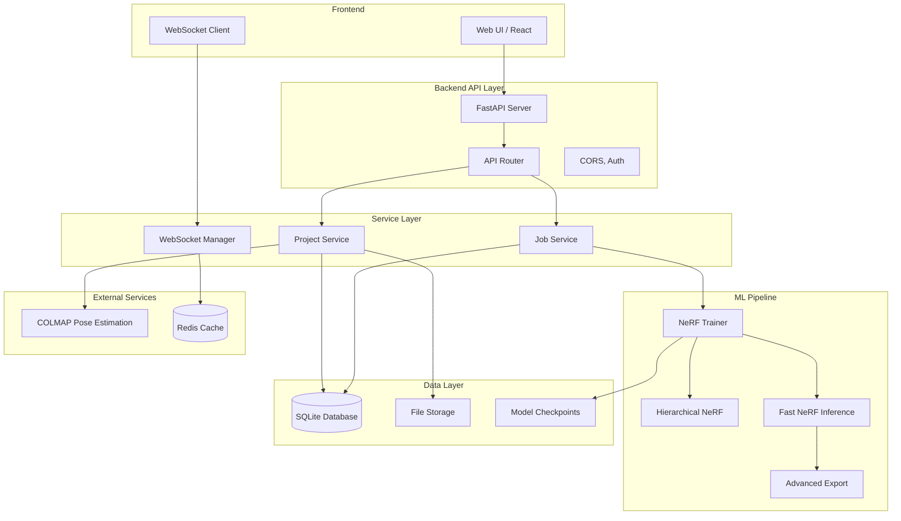

## 🔄 **API Request Flow**

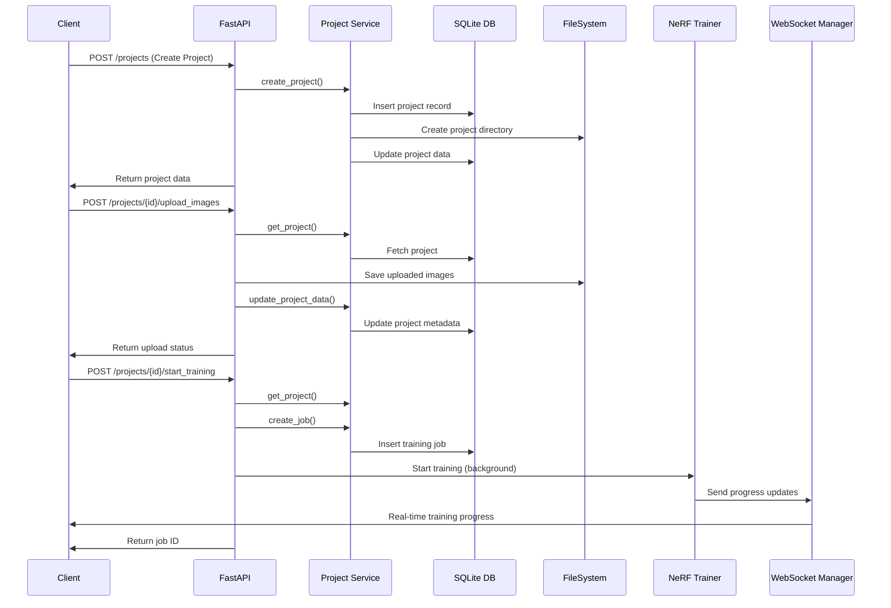

## 🎯 **NeRF Training Pipeline**

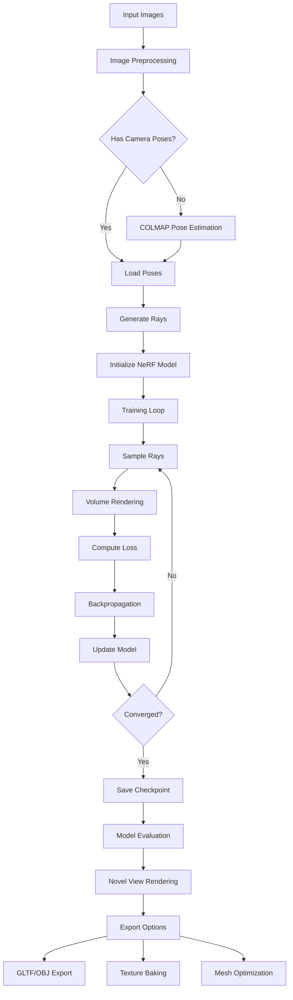

## 🗄️ **Database Schema**

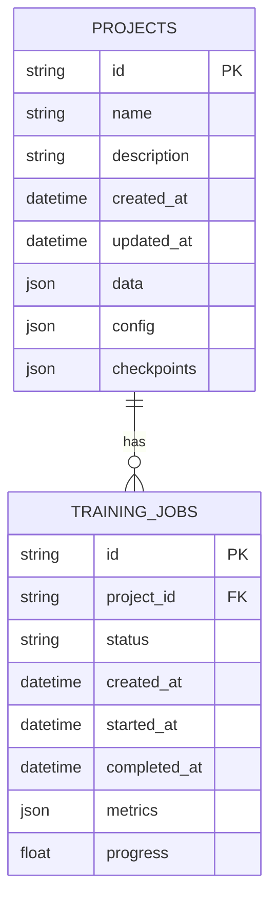

## 📁 **File System Structure**

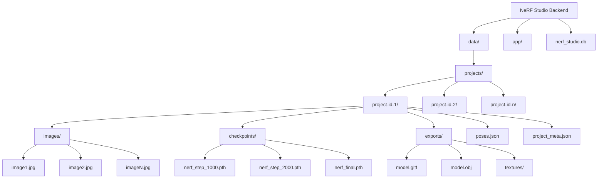

## 🔧 **Service Architecture**

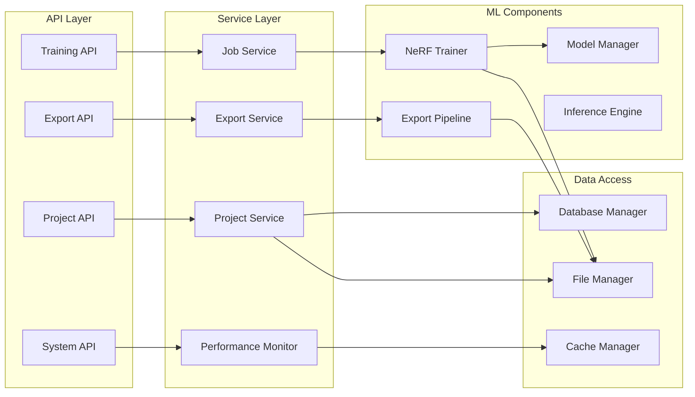

## 🌐 **WebSocket Communication Flow**

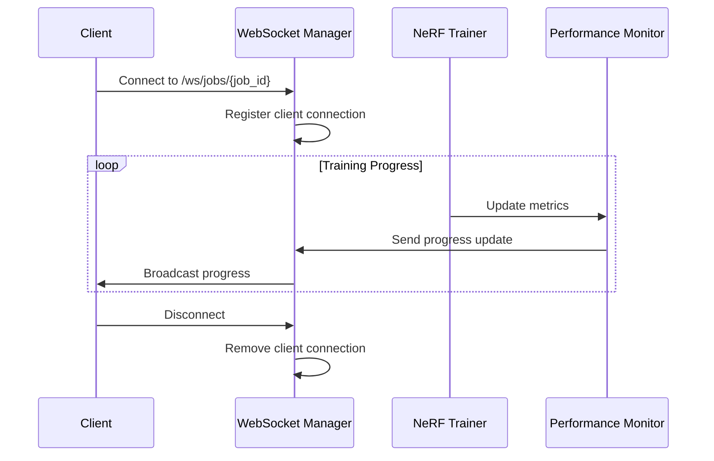

## 🚀 **Deployment Architecture**

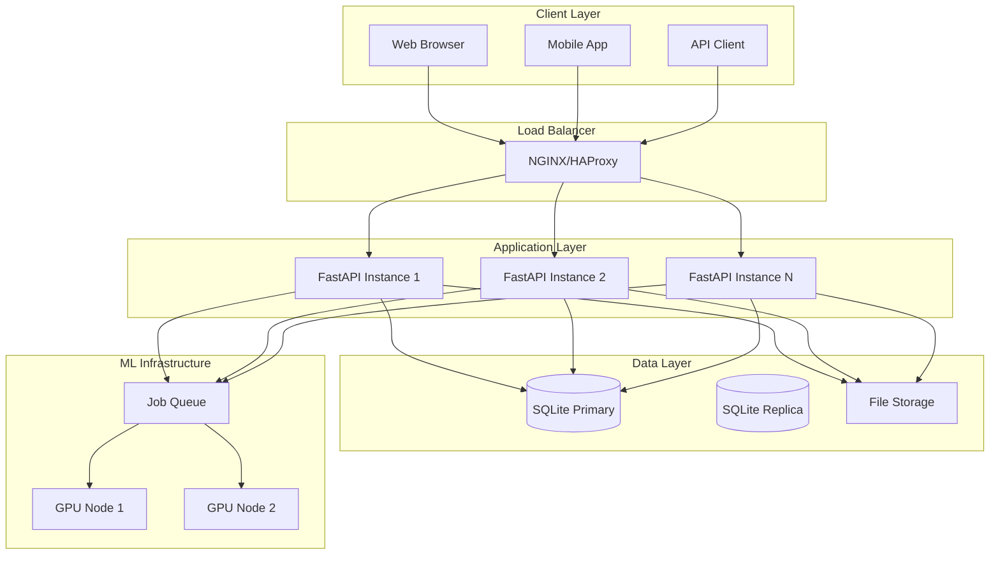

## 🔄 **Complete User Journey**

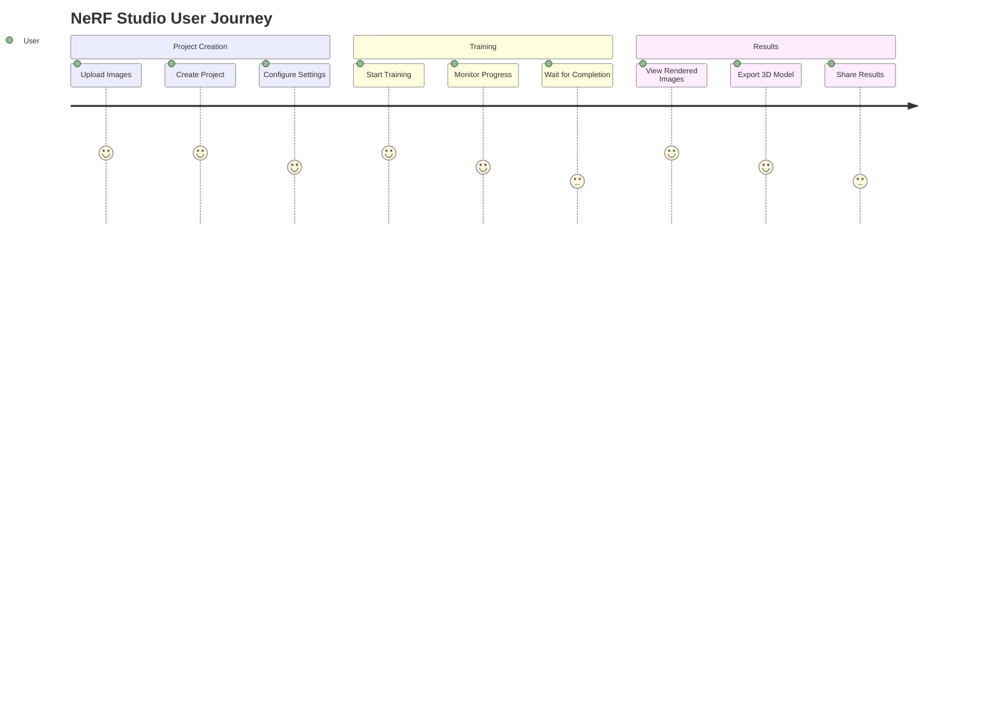

## 📊 **Performance Monitoring**

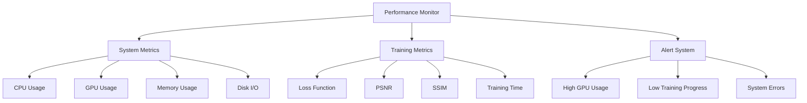

## 🔐 **Security Architecture**

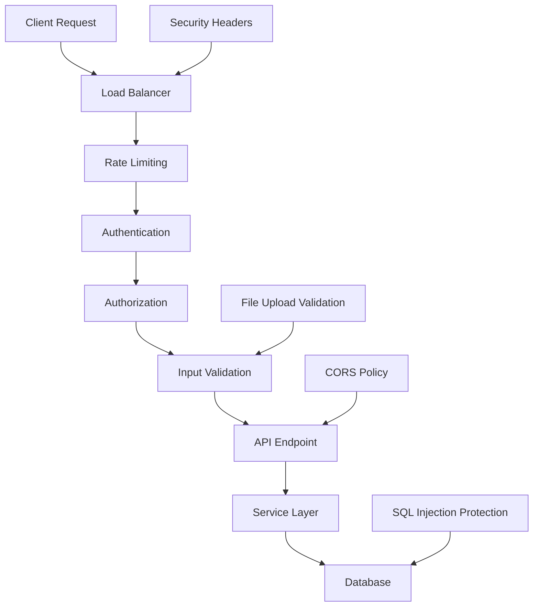

## 📈 **Scalability Architecture**

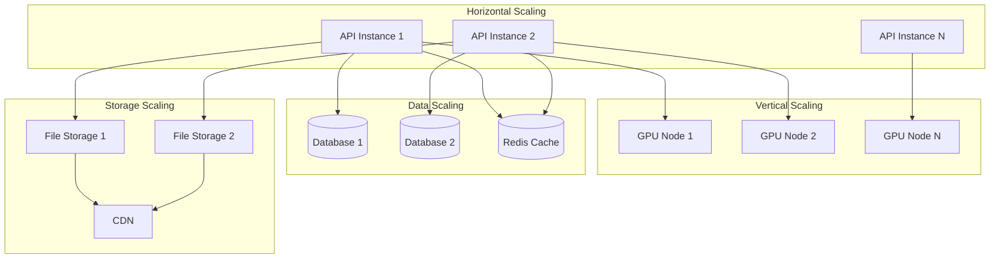

## 🎯 **Key Components Summary**

| Component | Purpose | Technology |
|-----------|---------|------------|
| **FastAPI** | Web framework | Python |
| **SQLite** | Database | File-based |
| **NeRF Model** | 3D reconstruction | PyTorch |
| **WebSocket** | Real-time updates | Python |
| **COLMAP** | Pose estimation | C++/Python |
| **File Storage** | Image/model storage | Local filesystem |
| **Performance Monitor** | System monitoring | Python |

## 🔧 **Configuration Management**

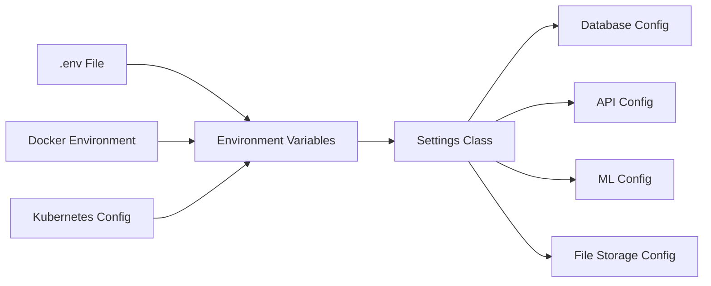

---

**📝 Usage Instructions:**
1. Copy any diagram code block
2. Paste into Mermaid Live Editor: https://mermaid.live/
3. Customize colors, styling, and layout
4. Export as PNG, SVG, or PDF
5. Use in documentation, presentations, or architecture docs 