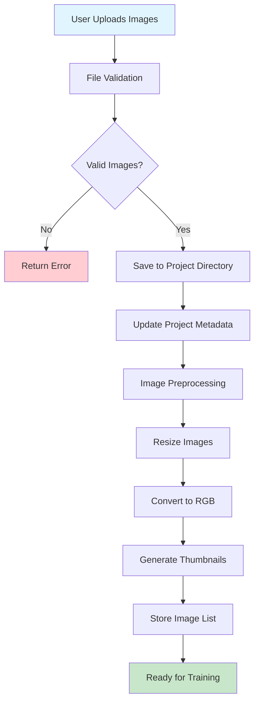
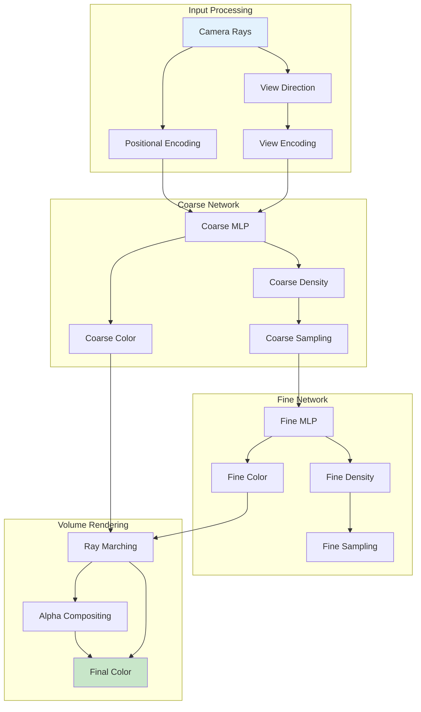
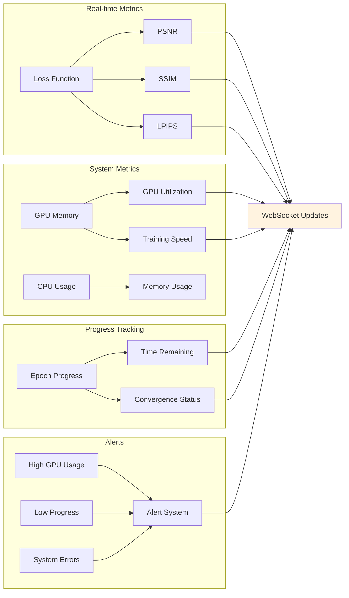
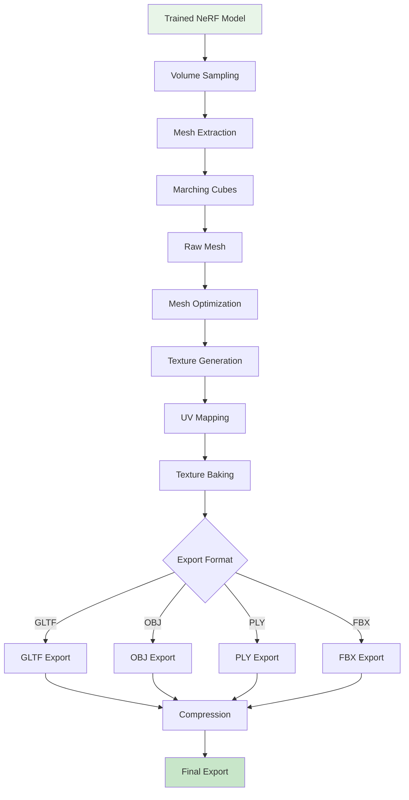
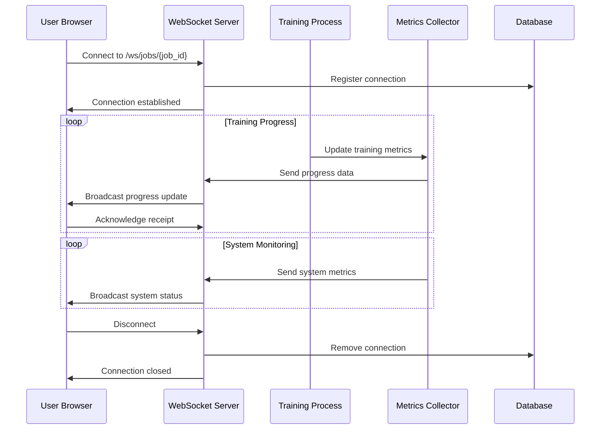
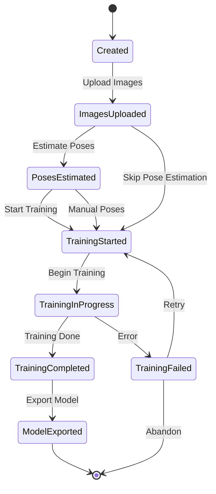
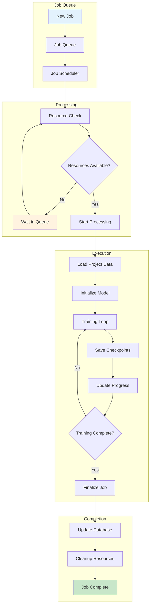
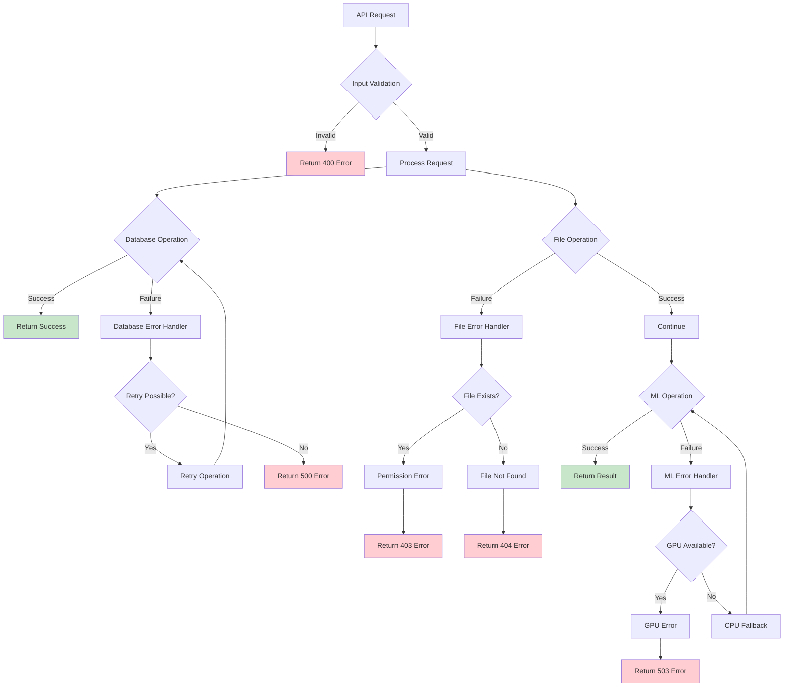
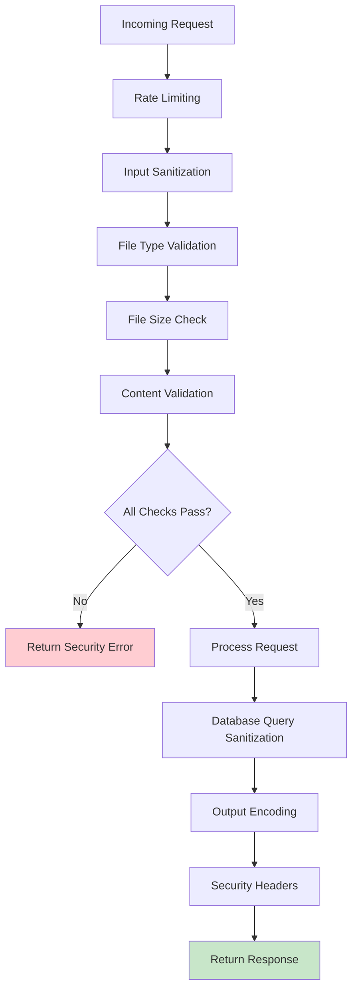

# 🎯 Specialized NeRF Studio Diagrams

## 🔄 **Image Upload & Processing Pipeline**



## 🎨 **NeRF Model Architecture**



## 📊 **Training Metrics & Monitoring**



## 🔧 **Export Pipeline Architecture**



## 🌐 **WebSocket Real-time Communication**



## 🗂️ **Project Lifecycle Management**



## 🔄 **Background Job Processing**



## 📱 **API Endpoint Structure**

```mermaid
graph TD
    A[FastAPI Router] --> B[Project Endpoints]
    A --> C[Training Endpoints]
    A --> D[Export Endpoints]
    A --> E[System Endpoints]
    A --> F[WebSocket Endpoints]
    
    B --> B1[POST /projects]
    B --> B2[GET /projects]
    B --> B3[GET /projects/{id}]
    B --> B4[DELETE /projects/{id}]
    B --> B5[POST /projects/{id}/upload_images]
    B --> B6[POST /projects/{id}/estimate_poses]
    
    C --> C1[POST /projects/{id}/start_training]
    C --> C2[GET /jobs/{id}]
    C --> C3[GET /projects/{id}/jobs]
    C --> C4[GET /jobs/{id}/metrics]
    
    D --> D1[POST /projects/{id}/export/advanced]
    D --> D2[GET /exports/{id}/status]
    D --> D3[GET /projects/{id}/download_export]
    
    E --> E1[GET /system/metrics]
    E --> E2[GET /docs]
    E --> E3[GET /redoc]
    
    F --> F1[WS /ws/jobs/{id}]
    
    style A fill:#e8f5e8
    style B1 fill:#e3f2fd
    style C1 fill:#e3f2fd
    style D1 fill:#e3f2fd
    style F1 fill:#e3f2fd
```

## 🔍 **Error Handling & Recovery**



## 🎯 **Performance Optimization Flow**

```mermaid
graph LR
    subgraph "Input Optimization"
        A[Image Resizing] --> B[Batch Processing]
        B --> C[Memory Management]
    end
    
    subgraph "Model Optimization"
        D[Model Pruning] --> E[Quantization]
        E --> F[Mixed Precision]
    end
    
    subgraph "Training Optimization"
        G[Gradient Accumulation] --> H[Learning Rate Scheduling]
        H --> I[Early Stopping]
    end
    
    subgraph "Inference Optimization"
        J[Model Caching] --> K[Batch Inference]
        K --> L[GPU Memory Pinning]
    end
    
    C --> D
    F --> G
    I --> J
    L --> M[Optimized Performance]
    
    style M fill:#c8e6c9
```



## 🔐 **Security & Validation Flow**



---

**🎨 Customization Tips:**

1. **Colors**: Use consistent color schemes for different types of components
   - Blue: Data/Storage components
   - Green: Success/Completion states
   - Red: Errors/Failures
   - Orange: Warnings/Processing
   - Purple: ML/AI components

2. **Styling**: Add `style` commands to highlight important nodes
3. **Layout**: Use different graph directions (TB, LR, TD) for different perspectives
4. **Grouping**: Use subgraphs to organize related components
5. **Flow**: Use different arrow styles to show different types of relationships

**📊 Export Options:**
- PNG: For presentations and documentation
- SVG: For web use and scaling
- PDF: For print and formal documentation 